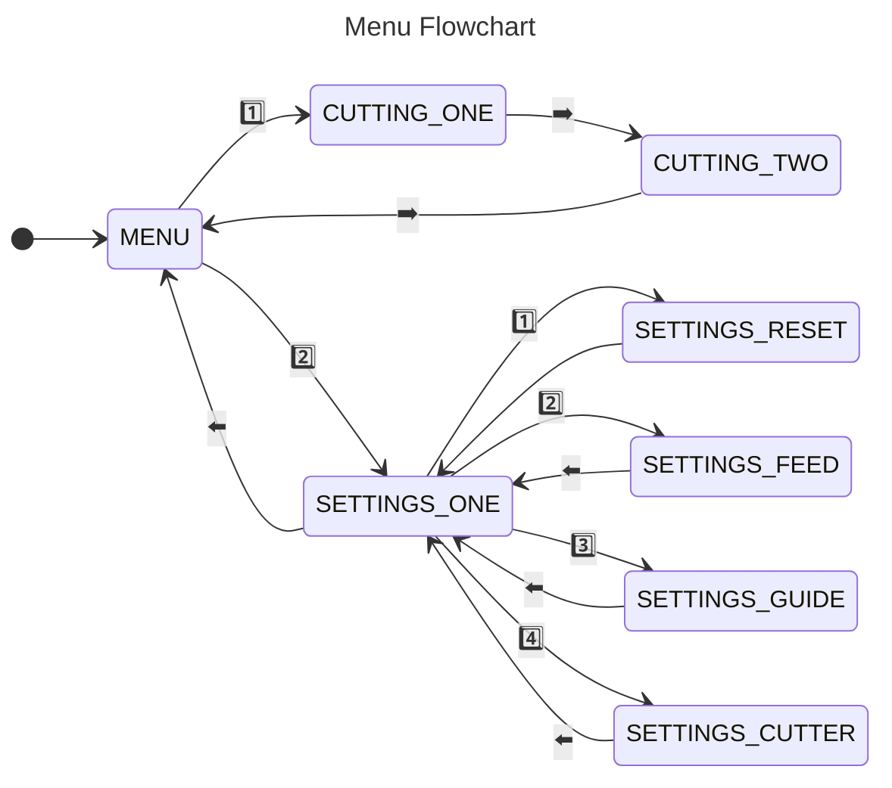

## Motivation
For our [ECE 4180 (Embedded Systems Design)](https://ece.gatech.edu/courses/ece4180) final project, two teammates and I decided to help [HKN](https://hkn.gtorg.gatech.edu/) automate its wire-production process for lab kits. Every semester, as part of a lab-packaging event, members cut and strip over 800 wires, which represents a lot of time and effort.

## System Design


## Schematic & Components

| Item                        | Quantity |
| :---------------------------- | :--------- |
| 12V DC Motor               | 1        |
| 2-Pole Stepper Motor       | 1        |
| [A4988 Stepper Motor Driver](https://www.pololu.com/product/1182) | 1        |
| [Dual H-Bridge Motor Driver](https://www.sparkfun.com/products/14451)                  | 1        |
| Hall Effect Wheel Encoder  | 1        |
| Limit Switches            | 2       |
| [mBED LPC1768 Microcontroller](https://os.mbed.com/platforms/mbed-LPC1768/)              | 1        |
| [microSD Card Reader](https://www.sparkfun.com/products/544)             | 1        |
| Servo Motor                | 1        |
| UART Bluetooth Module      | 1        |
| [uLCD-144-G2 GFX Display](https://www.sparkfun.com/products/11377)    | 1        |

## RTOS Threads

| Thread | Sleep | Description |
| :------ | :----- | :----------- |
| `updateWireLeft()` | 1s | Update upper half of uLCD: wire left on spool
| `updateBottomScreen()` | 100ms | Update lower half of uLCD: menus
| `saveWireLeft()` | 1 min | Save wire left onto SD card
| `heartbeat()` | 1s | Blink LED4
| `main()` | 100 ms | Run BLE-based state machine

## State Machine

## Demo

