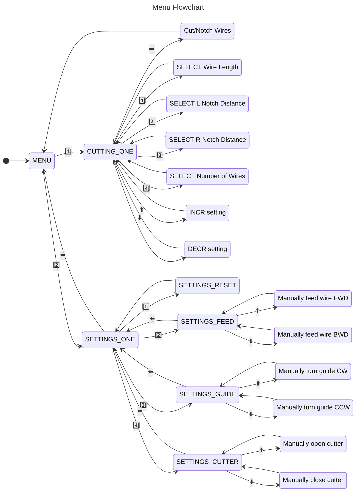

## Motivation
For our [ECE 4180 (Embedded Systems Design)](https://ece.gatech.edu/courses/ece4180) final project, two teammates and I decided to help [HKN](https://hkn.gtorg.gatech.edu/) automate its wire-production process for lab kits. Every semester, as part of a lab-packaging event, members cut and strip over 800 wires, which requires substantial time and effort.

## System Design


The system works by unspooling wire into a Bowden extruder using a stepper motor. The wire is fed into a guide tube, which is taped to a servo motor. The servo motor can rotate such that the wire is fed into the notching or cutting part of the wire cutter. Finally, the wire cutter is attached to a DC motor via a wheel contraption. Two limit switches are in place to restrict the wire-cutter's motion.

## Parts List

| Item                        | Quantity |
| :---------------------------- | :--------- |
| 12V DC Motor               | 1        |
| 2-Pole Stepper Motor       | 1        |
| [A4988 Stepper Motor Driver](https://www.pololu.com/product/1182) | 1        |
| [Dual H-Bridge Motor Driver](https://www.sparkfun.com/products/14451)                  | 1        |
| [Hall Effect Wheel Encoder Kit](https://www.sparkfun.com/products/12629) | 1        |
| [Hitec HS-422 Servo Motor](https://www.sparkfun.com/products/11884)                | 1        |
| Limit Switches            | 2       |
| [mBED LPC1768 Microcontroller](https://os.mbed.com/platforms/mbed-LPC1768/)              | 1        |
| [microSD Card Reader](https://www.sparkfun.com/products/544)             | 1        |
| [UART Bluefruit LE Module](https://www.adafruit.com/product/2479)      | 1        |
| [uLCD-144-G2 GFX Display](https://www.sparkfun.com/products/11377)    | 1        |

## RTOS Threads

| Thread | Sleep | Description |
| :------ | :----- | :----------- |
| `updateWireLeft()` | 1s | Update upper half of uLCD: wire left on spool
| `updateBottomScreen()` | 100ms | Update lower half of uLCD: menus
| `saveWireLeft()` | 1 min | Save wire left onto SD card
| `heartbeat()` | 1s | Blink LED4. LED staying on/off indicates error
| `main()` | 100 ms | Run BLE-based state machine

## Bluetooth Control State Machine

Using the [Bluefruit LE Connect App](https://learn.adafruit.com/bluefruit-le-connect/ios-setup), the user is able to control the machine using arrow or number key input. Every key press provides serial data to the Bluefruit module, which triggers an interrupt handler that records the action.

A small LCD screen provides a menu interface allowing a user to intuitively toggle settings. Below is a state diagram of the control flow:

## Demo


## Results & Potential Improvements
Despite the smooth interface and sufficient precision of 0.2", the machine's servo guide and wire-cutting mechanisms suffer from issues.

Firstly, the 3D-printed wheel attached to the DC motor shaft often comes loose in motion, despite using a wedge. Introducing a screw into the shaft could fix this.

Secondly, the servo lacks precision and consistency when guiding the wire into the cutting or nothcing portions of the wire cutter. Mechanically, the tube requires better stabilization. On the software-side, the servo should use closed-loop control to ensure precision.

