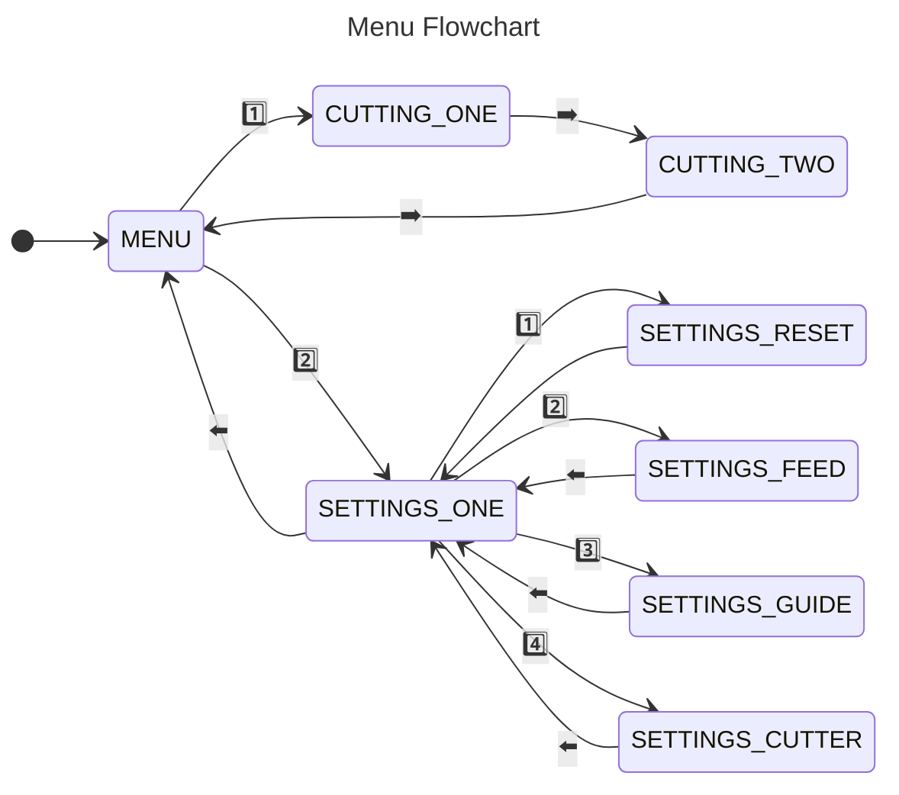

## Motivation
For our [ECE 4180 (Embedded Systems Design)](https://ece.gatech.edu/courses/ece4180) final project, two teammates and I decided to help [HKN](https://hkn.gtorg.gatech.edu/) automate its wire-production process for lab kits. Every semester, as part of a lab-packaging event, members cut and strip over 800 wires, which represents a lot of time and effort.

## System Design


## Demo

